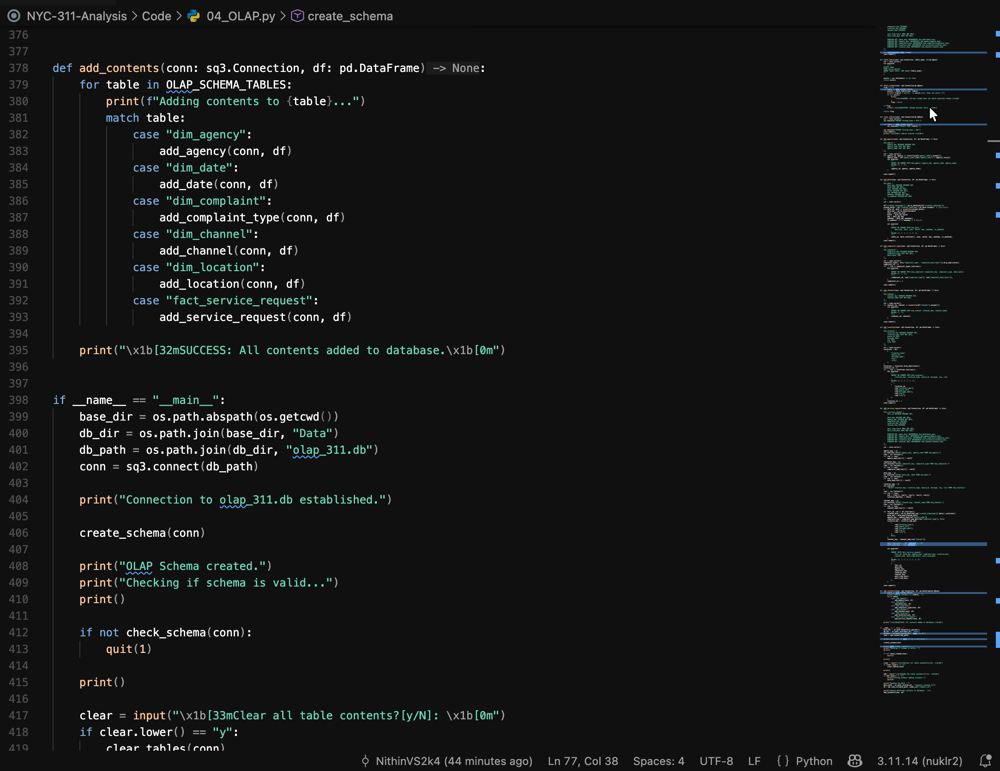

This is my settings for my VSCode theme. It is a modified version of Vesper theme with better syntax highlighting support for Python keywords, strings and parantheses.

You need to have Vesper Extension installed on your VSCode for this to work. This is not a standalone extension/theme.

> Note: This is a theme I made for my personal use, so it may have issues with edge cases and may not be foolproof.

Vesper Theme GitHub:
[https://github.com/raunofreiberg/vesper]

Example image:

